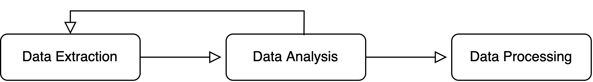

## Introduction

The execution of the project can be summarized with the following steps:

1. **Data extraction**: the procedure of getting the measurements from the server
2. **Data analysis**: this step of the process involves many steps. First we cleaned the data, then we analyzed it to build the dataset and to improve the process of data retrieval, since some measurements could only be found by exploiting informations retrieved from the server.
3. **Data Processing**: Once we built the dataset we processed the data by merging observations coming from the same coordinates, approximating the missing values and then we computed a possible position of Dory basing on its RSSI readings plus the fingerprinting database.



## Data Extraction

### MQTT

As for the tools emplyed we used [python with the paho mqtt library](mqtt/capture.py) to contact the server and retrieve data. The script first establishes a connection to the server, then subscribes to all avalaible topics using the `#` metacharacter, and lastly it listens for exactly 60 minutes. A quite long listen time was necessary because the data relative to the $(8.0, 4.0)$ position had a low periodicity, meaning that with shorter capture times it was not to be found. The result of the capture is then saved to the `data.json` file.

Some measurements were manually extreacted and used in later steps of the data extraction process because they contain valuable informations on COAP data retrieval, namely the following ones:

| Topic                          | Payload                                                      |
| ------------------------------ | ------------------------------------------------------------ |
| `coap/post/mixed/`             | `?problem=memory`                                            |
| `coap/post/mixed/`             | `go to the Doctor of the BarrierReef`                        |
| `coap/lies`                    | `resources can be hidden, find all of them and you'll get a treasure` |
| `coap/hidden`                  | `find the HiddenTreasure in the BarrierReef`                 |
| `coap/resource`                | `/root/BarrierReef/FishLocator?user=Dory`                    |
| `anemone/in/the/barrier/reef`  | `/root/BarrierReef/Anemone?owner=Marlin`                     |
| `great/barrier/reef/with/post` | `/root/PostMe6?search=entry_post`                            |
| `other/coap/resource`          | `/root/BarrierReef/Apps?fingerprint=True`                    |
| `other/coap/resource`          | `&gps=False`                                                 |
| `other/coap/resource`          | `wait for this A LOT!`                                       |

### COAP

To retrieve COAP data we used mainly two tools: Firefox with Copper running on the course virtual machine, and [tzolov/coap-shell](https://github.com/tzolov/coap-shell). Using the latter we executed a `discover` request which exposed several resources, which we saved at `coap/resources.txt`. Then by exploiting the following MQTT message:

| Topic         | Payload                                      |
| ------------- | -------------------------------------------- |
| `coap/hidden` | `find the HiddenTreasure in the BarrierReef` |

We manually added `/root/BarrierReef/HiddenTreasure` to the resource list.

Lastly for each available resource we performed a request for each COAP method type, with special care for resources which needed an `observe` request. We wrote down all interesting responses in [a text file](../coap/coap_coords_raw.txt).

The result of both data extraction procedures is avalaible respectively at `mqtt/data.json` and `coap/coap_coords_raw.txt`.

### Retrieving Dory's RSSI

Lastly we needed Dory RSSI measurement to apply our fingerprinting technique. To retrieve such values we used COAP and in particular we perform a `GET` request with the `observe` option marked to the `BarrierReef/Dory_observe` resource. After some time we got the following response:

```
coap://131.175.120.117:5683/root/BarrierReef/Dory_observe
Dory just remembered her RSSI vector: [-57,-63,-58,-64,-63,-66]
```

Which contained what we needed.

## Data Analysis

The data analysis steps are carefully documented in the [`localization.ipynb`](localization.ipynb) Jupyter Notebook. The steps involved in the process are the following:

1. **Cleaning Data**: Regarding MQTT we used python to delete repeated entries and delete invalid ones, such as entries with invalid coordinates or RSSI parameters, resulting in 14 valid unique observations saved in the `mqtt_coords.txt` file. The scripts used to analyze the data are available in the `mqtt` subdirectory.

   COAP instead required manual analysis. We parsed the entries marked as useful in the `coap_coords_raw.txt` source file with a [python script](../coap/data-processing.py) to make it into a format more suitable for later processing. This process was mostly manual; this was an intentional process decision due to the high diversity and low numerosity of the CoAP responses.

2. **Importing data**: first we created two dataframes containing the values from the MQTT and COAP observations, then we merged them in a unique dataset.

3. **Preparing data**: since we had 5 different RSSI measurements for each even coordinate, we computed the average of each of them and got a new dataset with unique coordinates for each row. Then we interpolated the values belonging to the missing coordinates, which are all coordinates with odd values.

## Data Processing

Since the dataset is now ready, we proceeded to find the Euclidean distance w.r.t. Dory RSSI values for each coordinate of both the dataset containing only the real measurements, and the dataset which also contains the interpolated ones. The latter was more interesting since it's a more realistic estimate of Dory's position. The coordinates which has the lowest Euclidean distance are $(2, 3)$:

| x    | y    | A1    | A2    | A3    | A4    | A5    | A6    | Euclidean Distance |
| ---- | ---- | ----- | ----- | ----- | ----- | ----- | ----- | ------------------ |
| 2    | 3    | -56.3 | -62.2 | -57.8 | -63.4 | -62.8 | -65.7 | 1.28841            |
