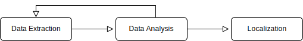
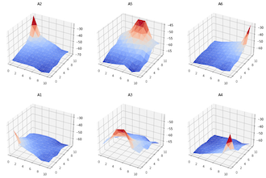

## Introduction

The execution of the project can be summarized with the following steps:

1. **Data extraction**: the procedure of getting the measurements from the server
2. **Data analysis**: this step of the process involves many steps. First we cleaned the data, then we analyzed it to build the dataset and to improve the process of data retrieval, since some measurements could only be found by exploiting informations retrieved from the server.
3. **Localization**: Once we built the dataset we processed the data by merging observations coming from the same coordinates, approximating the missing values and then we computed a possible position of Dory basing on its RSSI readings plus the fingerprinting database.



## Data Extraction

### MQTT

As for the tools emplyed we used [python with the paho mqtt library](mqtt/capture.py) to contact the server and retrieve data. The script first establishes a connection to the server, then subscribes to all avalaible topics using the `#` metacharacter, and lastly it listens for exactly 60 minutes. Every message received is saved as a dictionary in a JSON file with the following syntax:

```python
msg = {
        "topic": message.topic,
        "payload": message.payload.decode("utf-8"),
        "qos": message.qos,
        "retain": message.retain,
}
```

Where `Message` is an object of the `paho-mqtt` library which contains newly received messages from the MQTT client. This format is suited to be analyzed with python later on.

A quite long listen time was necessary because the data relative to the $(8.0, 4.0)$ position had a low periodicity, meaning that with shorter capture times it was not to be found. The result of the capture is then saved to the `data.json` file.

Some measurements were manually extreacted and used in later steps of the data extraction process because they contain valuable informations on COAP data retrieval, namely the following ones:

| Topic                          | Payload                                                      |
| ------------------------------ | ------------------------------------------------------------ |
| `coap/post/mixed/`             | `?problem=memory`                                            |
| `coap/post/mixed/`             | `go to the Doctor of the BarrierReef`                        |
| `coap/lies`                    | `resources can be hidden, find all of them and you'll get a treasure` |
| `coap/hidden`                  | `find the HiddenTreasure in the BarrierReef`                 |
| `coap/resource`                | `/root/BarrierReef/FishLocator?user=Dory`                    |
| `anemone/in/the/barrier/reef`  | `/root/BarrierReef/Anemone?owner=Marlin`                     |
| `great/barrier/reef/with/post` | `/root/PostMe6?search=entry`                            |
| `other/coap/resource`          | `/root/BarrierReef/Apps?fingerprint=True`                    |
| `other/coap/resource`          | `&gps=False`                                                 |
| `other/coap/resource`          | `wait for this A LOT!`                                       |

### COAP

To retrieve COAP data we used mainly two tools: Firefox with Copper running on the course virtual machine, and [tzolov/coap-shell](https://github.com/tzolov/coap-shell). Using the latter we executed a `discover` request which exposed several resources, which we saved at `coap/resources.txt`. Then by exploiting the following MQTT message:

| Topic         | Payload                                      |
| ------------- | -------------------------------------------- |
| `coap/hidden` | `find the HiddenTreasure in the BarrierReef` |

We manually added `/root/BarrierReef/HiddenTreasure` to the resource list.

Lastly for each available resource we performed a request for each COAP method type using Copper, with special care for resources which needed an `observe` request. We wrote down all interesting responses in [a text file](../coap/coap_coords_raw.txt).

The result of both data extraction procedures is avalaible respectively at `mqtt/data.json` and `coap/coap_coords_raw.txt`.

### Retrieving Dory's RSSI

Lastly we needed Dory RSSI measurement to apply our fingerprinting technique. To retrieve such values we used COAP and in particular we perform a `GET` request with the `observe` option marked to the `BarrierReef/Dory` resource. After some time we got the following response:

```shell
$ connect coap://131.175.120.117
available
$ observe coap://131.175.120.117:5683/root/BarrierReef/Dory_observe
OBSERVE START coap://131.175.120.117coap://131.175.120.117:5683/root/BarrierReef/Dory_observe
```

After some time we got the following response:

```shell
coap://131.175.120.117:5683/root/BarrierReef/Dory_observe
Dory just remembered her RSSI vector: [-57,-63,-58,-64,-63,-66]
```

Which was exactly what we needed to finished the data extraction process.

## Data Analysis

The data analysis steps are carefully documented in the [`localization.ipynb`](localization.ipynb) Jupyter Notebook. The steps involved in the process are the following:

### Cleaning Data

#### MQTT

Regarding MQTT we used python to delete repeated entries and delete invalid ones, such as entries with invalid coordinates or RSSI parameters, resulting in 14 valid unique observations saved in the `mqtt_coords.txt` file. The scripts used to analyze the data are available in the `mqtt` subdirectory.

First we removed duplicates:

```python
def remove_duplicates(data):
    res = []
    for msg in data:
        if msg not in res:
            res.append(msg)
    return res
```

Then we performed the following checks for each entry:

* Check that the entry actually contains a valid payload of the form `x,y | rssi_A1 | ... | rssi_A6`. 
* Check that the data is valid, i.e. it's numerical data with reasonable values

To achieve that we used python `re` regex library:

```python
for msg in data:
        if msg["payload"].count("|") == 6:

            coords_regex = r"(\d{1,2}\.0),(\d{1,2}\.0)"
            rssi_regex = r"\|(-?\d+),(-?\d+),(-?\d+),(-?\d+),(-?\d+)"

            if search(coords_regex, msg["payload"]) is None or
            	search(rssi_regex, msg["payload"]) is None:
                continue

            x = float(findall(coords_regex, msg["payload"])[0][0])
            y = float(findall(coords_regex, msg["payload"])[0][1])
            if x > bounds[1] or
            	x < bounds[0] or
              y > bounds[1] or
              y < bounds[0]:
                continue

            rssi = findall(rssi_regex, msg["payload"])
            for i in range(len(rssi)):
                rssi[i] = int(rssi[i][0])
                if rssi[i] < -100 or rssi[i] > -1:
                    continue
            res.append(msg)
```

#### COAP

COAP instead required manual analysis. We parsed the entries marked as useful in the `coap_coords_raw.txt` source file with a [python script](../coap/data-processing.py) to make it into a format more suitable for later processing. This process was mostly manual; this was an intentional process decision due to the high diversity and low numerosity of the CoAP responses.

### Importing data

First we created two dataframes containing the values from the MQTT and COAP observations:

```python
...
df_mqtt = pd.DataFrame(
  data=data_mqtt,
  columns=["X", "Y", "exp_id", "A1", "A2", "A3", "A4", "A5", "A6"]
)
...
df_coap = pd.DataFrame(
  data=data_coap,
  columns=["X", "Y", "exp_id", "A1", "A2", "A3", "A4", "A5", "A6"]
)
```

Then we merged them in a unique dataset:

```python
df = pd.concat([df_coap, df_mqtt])

# manually define Dory's RSSI
Dory_RSSI = [-57,-63,-58,-64,-63,-66]
Dory_RSSI_np = np.array(Dory_RSSI)

# dataset constraints to check if the data is valid
assert(len(df) == 6*6*5)
assert(df.isna().sum().sum() == 0)

display(df)
```

In this schema, the column `exp_id` identifies the experiment during which a reading was acquired. In the available fingerprints there were five distinct experiments.

The set of all fingerprints counts 180 entries and can be found in `data/raw_data.csv`

### Processing data

At this point of the process we had a reasonable dataset, but we still ran into some issues. First of all our dataset did not contain unique measurements but instead for each coordinate we had 5 different RSSI values. Moreover our dataset only contained measurements relative to even positions of the grid, but Dory could also be found in odd positions, so we needed a way to account for missing values. This part of the data analysis process is divided into two steps:

1. For each measurement, we computed the average of all 5 of its instances. The result was a new dataset with unique coordinates for each row.

   ```python
   means_data = []
   for x in range(0,11,2):
       for y in range(0,11,2):
         row = [x,y]
         row += df.loc[(df['X'] == x) & (df['Y'] == y)
         	.mean()[["A1", "A2","A3","A4","A5","A6"]].values.tolist()
         means_data.append(row)
   df_means = pd.DataFrame(
     data=means_data,
     columns=['X', 'Y', "A1", "A2", "A3", "A4", "A5", "A6"]
   )
   ```

2. Then we interpolated the values belonging to the missing coordinates.

   * If the position was not in the original dataframe and its adjacent positions were present, the corresponding entry is the average of the adjacent entries from the original dataframe (**linear interpolation**).

   * If the position was not in the original dataframe and its adjacent positions were also not present, the corresponding entry is the average of the adjacent entries computed in the new dataframe dataframe (**bilinear interpolation**).

   We also plotted the signal strength curve for visual inspection of any evident mistake:

   

   The plots above shows reasonable signals for wifi RSSI propagation.

## Localization

We will show two analysis approaches.

* **Pure mathematical**: We computed the euclidean distances of all produced data points from the reference RSSI and selected the minimum distance one.

* **Machine Learning**: We used all available fingerprints to train a KNN model, which we then use to classify the reference RSSI; the produced results are aggregated with a truncated weighted average.

### Pure mathematical approach

Now that we have managed to average the values of repeated measurements and to approximate the missing ones, we can compute the Euclidean distance of each fingerprint in the interpolated dataframe from the Dory RSSI sample.

```python
def compute_euclidean_distance(row):
  return np.linalg.norm(Dory_RSSI_np - row[["A1", "A2", "A3", "A4", "A5", "A6"]])

df_interpolation['Euclidean Distance'] = df_interpolation.
	apply(compute_euclidean_distance, axis=1)
display(df_interpolation.nsmallest(10, 'Euclidean Distance', 'all'))
```

Visual inspection of the smallest computed euclidean distances shows reasonable values and clustering around similar coordinates. The coordinates which has the lowest Euclidean distance are $(2, 3)$:

| x    | y    | A1    | A2    | A3    | A4    | A5    | A6    | Euclidean Distance |
| ---- | ---- | ----- | ----- | ----- | ----- | ----- | ----- | ------------------ |
| 2    | 3    | -56.3 | -62.2 | -57.8 | -63.4 | -62.8 | -65.7 | 1.28841            |

Repeating the same operation for the original dataframe, with no interpolation and all individual samples, shows coherent results.

```python
df['Euclidean Distance'] = df.apply(compute_euclidean_distance, axis=1)
display(df.nsmallest(10, 'Euclidean Distance', 'all'))
```

| x    | y    | A1   | A2   | A3   | A4   | A5   | A6   | Euclidean Distance |
| ---- | ---- | ---- | ---- | ---- | ---- | ---- | ---- | ------------------ |
| 2    | 4    | -58  | -61  | -59  | -64  | -62  | -65  | 2.828427           |

### Machine learning approach

#### KNN

Most of our approaches are based on KNN, as seen in class. The first two are sound from a ML-theoretical perspective, but fail to produce reasonable result. The last one produces a reasonable result, but presents critical flaws from ML theory.

#### ML-theoretical: fingerprint alone

We model the localization problem as a multiclass classification problem. We associate to each position a class and to each class al ground truth label. We build the labels with a simple bijective function `f(int, int) -> str` based on the `(x,y)` positions of each fingerprint. This creates 36 distinct classes for our 180 fingerprints. We then split train and test set with `1./5.` ratio and stratified sampling. This allows us to have a representative dataset in both training and testing.

The confusion matrix shows a reasonable behaviour for such a model with better than random guessing performance. The accuracy plot shows that precision drops as the number of neighbors inreases.

The critical flaw of this model is that it cannot identify any odd position. It's limited to the even positions present in the training set.

#### ML-theoretical: exp-based interpolations

We model the localization model like before. We consider each experiment as the set of measurements from each anchor, that is `36=6*6*1` samples. We augment each experiment with linear and bilinear interpolations to produce `121=11*11*1` data points for each experiment, including both odd and even positions. This produces `605=11*11*5` data points from the entire dataset. We then proceed like before, with stratified sampling and reasonable train/test split, to produce representative datasets for training and testing. 

The confusion matrix shows again performance better than random guessing and the accuracy tracking shows decreasing performance as more neighborgs are considered. Producing a confusion matrix for 121-class KNN classification is computationally expensive hard on our laptops

#### Custom: test-free cross-exp average only

Our last approach consists in taking the average of all experiments for each position and only then filling in missing (odd) values with interpolations. This produces a set of 121 data points, exactly one for each class. This makes it impossible to use any proper ML technique, as train/test split is impossible. We train a KNN classifier on this entire dataset and ask it to predict Dory's position.

This always produces the same result for up to ten neighborgs